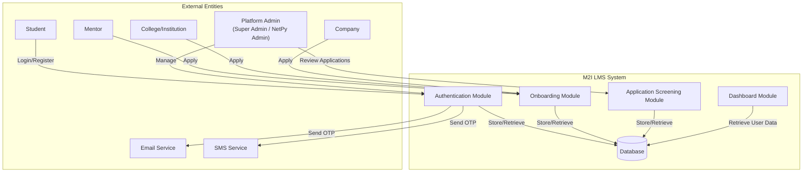
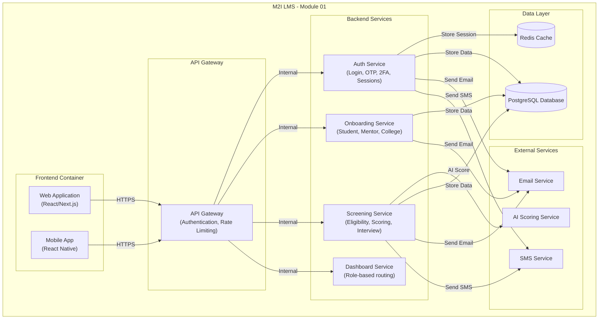
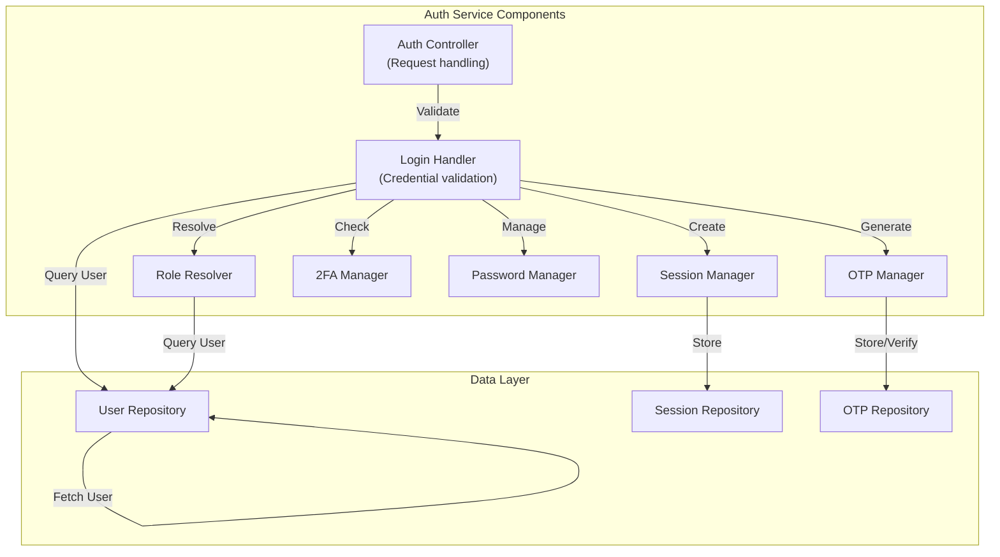
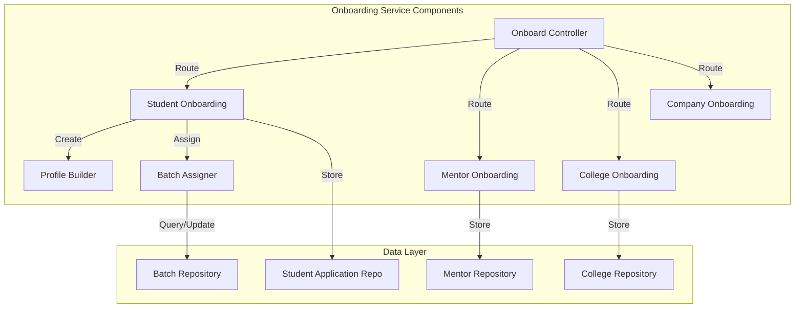
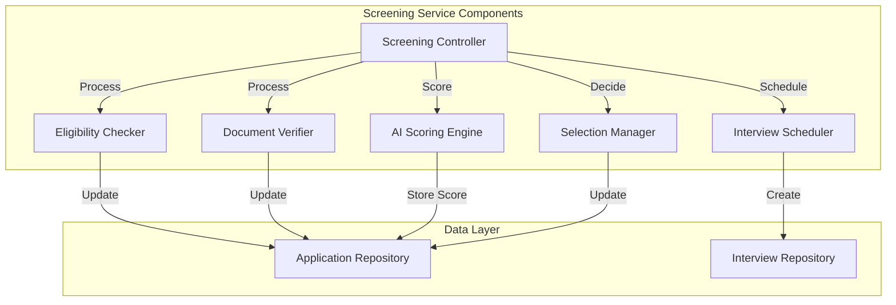
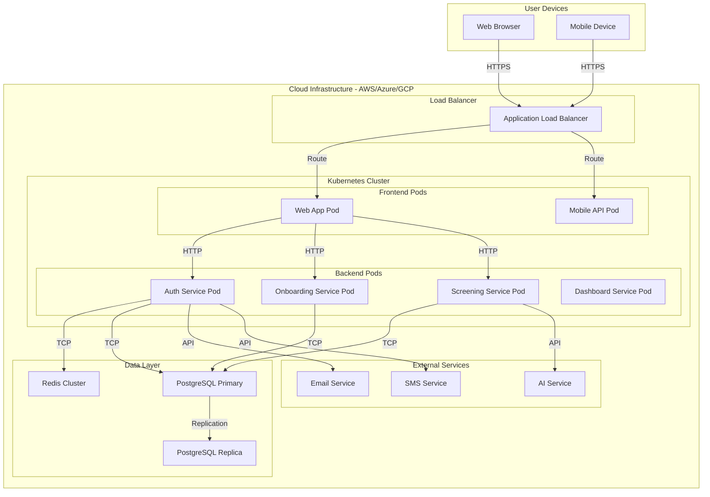
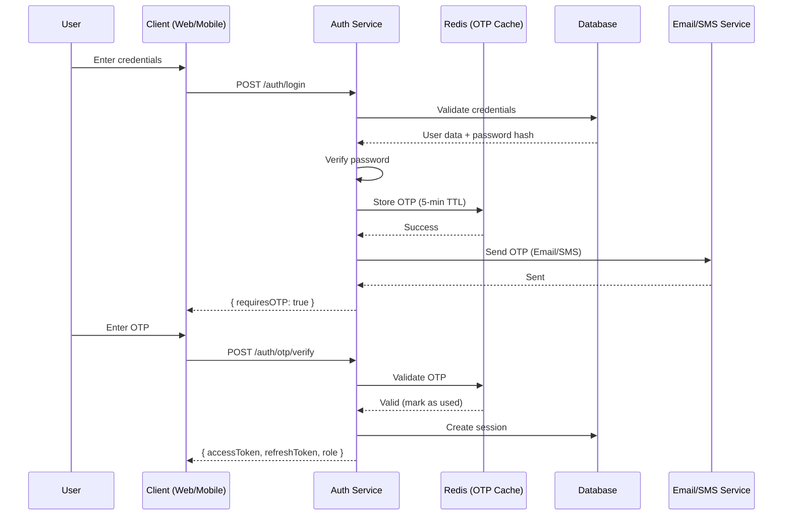

# Module 01: Authentication, Governance & Onboarding Flow - C4 Architecture

## Overview

This document describes the C4 architecture for the M2I Learning Management System (LMS) Module 01, which covers authentication, role-based governance, and onboarding flows.

---

## 1. System Context Diagram (Level 1)

### 1.1 Context Overview



### 1.2 System Description

| Element | Description |
|---------|-------------|
| **System Name** | M2I Learning Management System (LMS) |
| **System Purpose** | Provide secure authentication, role-based governance, and comprehensive onboarding for students, mentors, colleges, and companies |
| **Users** | Students, Mentors, College Admins, Platform Admins, Companies |
| **External Systems** | Email Service (SMTP/SendGrid), SMS Service (Twilio/Other), AI Scoring Service |

### 1.3 Key Interactions

| User | Interaction | Purpose |
|------|-------------|----------|
| Student | Apply for program | Submit application via college-side or direct path |
| Student | Login | Access platform with OTP + password authentication |
| Mentor | Apply to become mentor | Submit mentor application with credentials |
| College | Register institution | Submit college application for verification |
| Admin | Verify/approve | Review applications and onboard users |
| Admin | Manage roles | Assign and manage 5-tier governance roles |

---

## 2. Container Diagram (Level 2)

### 2.1 Container Overview



### 2.2 Container Responsibilities

| Container | Responsibility | Technology |
|-----------|----------------|------------|
| **Web Application** | User interface for web-based authentication and onboarding | React/Next.js |
| **Mobile App** | User interface for mobile-based authentication and onboarding | React Native |
| **API Gateway** | Request routing, authentication, rate limiting | Express/NestJS |
| **Auth Service** | Login, OTP generation/verification, 2FA, session management | Node.js/NestJS |
| **Onboarding Service** | Student, mentor, college, company onboarding workflows | Node.js/NestJS |
| **Screening Service** | Application eligibility, document verification, AI scoring, interview scheduling | Node.js/NestJS |
| **Dashboard Service** | Role-based routing and dashboard access | Node.js/NestJS |
| **PostgreSQL** | Primary data store for users, applications, roles | PostgreSQL |
| **Redis** | Session management, OTP caching, rate limiting | Redis |
| **Email Service** | Transactional emails (OTP, notifications) | SendGrid/SMTP |
| **SMS Service** | OTP delivery via SMS | Twilio |
| **AI Scoring Service** | Application scoring and analysis | Python/ML |

### 2.3 Container APIs

| Service | Endpoint Pattern | Description |
|---------|------------------|-------------|
| Auth Service | `/api/v1/auth/*` | Authentication endpoints |
| Onboarding Service | `/api/v1/onboarding/*` | Onboarding workflows |
| Screening Service | `/api/v1/applications/*` | Application processing |
| Dashboard Service | `/api/v1/dashboard/*` | Dashboard data |

---

## 3. Component Diagram (Level 3)

### 3.1 Authentication Component Diagram



### 3.2 Onboarding Component Diagram



### 3.3 Screening Component Diagram



### 3.4 Component Responsibilities

| Component | Responsibility | Public API |
|-----------|----------------|------------|
| **Login Handler** | Validates credentials, triggers OTP | `login(credentials)` |
| **OTP Manager** | Generates/validates 6-digit OTPs | `generateOTP(userId)`, `verifyOTP(code)` |
| **Session Manager** | Creates/refreshes JWT tokens | `createSession(userId)`, `refreshSession(token)` |
| **2FA Manager** | TOTP validation, backup codes | `enable2FA(userId)`, `verify2FA(code)` |
| **Role Resolver** | Maps user to 5-tier governance | `resolveRole(user)` |
| **Student Onboarding** | Handles dual-path student onboarding | `submitApplication(data)`, `completeOnboarding(userId)` |
| **Mentor Onboarding** | Processes mentor applications | `submitMentorApplication(data)`, `verifyMentor(id)` |
| **College Onboarding** | Processes college registration | `submitCollegeApplication(data)`, `approveCollege(id)` |
| **Eligibility Checker** | Validates application criteria | `checkEligibility(applicationId)` |
| **Document Verifier** | Verifies uploaded documents | `verifyDocument(docId)` |
| **AI Scoring Engine** | Scores applications via AI | `scoreApplication(applicationId)` |
| **Interview Scheduler** | Schedules interviews | `scheduleInterview(applicationId, slots)` |
| **Selection Manager** | Approves/rejects applications | `selectApplication(id)`, `rejectApplication(id)` |

---

## 4. Deployment Diagram (Level 4)

### 4.1 Deployment Overview



### 4.2 Deployment Specifications

| Component | Deployment | Scaling | High Availability |
|-----------|------------|---------|-------------------|
| **Web Application** | Kubernetes Pod | Horizontal (HPA) | Multi-AZ |
| **Mobile API** | Kubernetes Pod | Horizontal (HPA) | Multi-AZ |
| **Auth Service** | Kubernetes Pod | Horizontal (HPA) | Multi-AZ |
| **Onboarding Service** | Kubernetes Pod | Horizontal (HPA) | Multi-AZ |
| **Screening Service** | Kubernetes Pod | Horizontal (HPA) | Multi-AZ |
| **Dashboard Service** | Kubernetes Pod | Horizontal (HPA) | Multi-AZ |
| **PostgreSQL** | RDS Multi-AZ | Vertical/Horizontal | Auto-failover |
| **Redis** | ElastiCache Cluster | Cluster mode | Multi-AZ |
| **Load Balancer** | ALB/GLB | Managed | Multi-AZ |

### 4.3 Data Flow Paths

| Scenario | Path |
|----------|------|
| User Login | Browser → LB → Auth Pod → Redis (session) → DB (user data) |
| OTP Flow | Auth Pod → Email/SMS Service |
| Application Submit | Browser → LB → Onboard Pod → DB |
| AI Scoring | Screening Pod → AI Service → DB |
| Dashboard Load | Browser → LB → Dashboard Pod → DB |

---

## 5. Security Architecture

### 5.1 Authentication Flow



### 5.2 Security Controls

| Control | Implementation |
|---------|-----------------|
| **Password Storage** | Argon2/PBKDF2 hashing with salt |
| **OTP** | 6-digit, 5-minute expiry, rate limiting |
| **Session** | JWT with short expiry (15 min), refresh token (7 days) |
| **2FA** | TOTP (Google Authenticator compatible) + backup codes |
| **Rate Limiting** | Redis-based, 10 attempts per minute |
| **Transport** | TLS 1.3, certificate pinning |
| **API Security** | JWT validation, role-based access control (RBAC) |

---

## 6. Data Models

### 6.1 Core Entities

| Entity | Description |
|--------|-------------|
| **User** | Base user entity with role, authentication data |
| **Student** | Student profile with application reference, batch |
| **Mentor** | Mentor profile with verification status |
| **College** | Institution profile with contacts, programs |
| **Company** | Company profile for placement/ internships |
| **StudentApplication** | Application with status, scoring, interview |
| **Interview** | Scheduled interview with scores |
| **Session** | Active user session with tokens |
| **OTP** | OTP verification record |

### 6.2 Role Governance (5-Tier)

| Role | Description | Permissions |
|------|-------------|--------------|
| **Super Admin** | Platform-wide admin | Full system access |
| **NetPy Admin** | Regional admin | Manage colleges, applications |
| **College Admin** | Institution admin | Manage students, mentors |
| **Mentor** | Instructor | View assigned students |
| **Student** | Learner | Own profile, courses |
| **Company** | Employer | View eligible students |

---

## 7. API Endpoints Summary

### 7.1 Authentication Endpoints

| Method | Endpoint | Description |
|--------|----------|-------------|
| POST | `/api/v1/auth/login` | Login with credentials |
| POST | `/api/v1/auth/otp/send` | Send OTP |
| POST | `/api/v1/auth/otp/verify` | Verify OTP |
| POST | `/api/v1/auth/2fa/enable` | Enable 2FA |
| POST | `/api/v1/auth/2fa/verify` | Verify 2FA |
| POST | `/api/v1/auth/logout` | Logout |
| GET | `/api/v1/auth/me` | Current user |

### 7.2 Onboarding Endpoints

| Method | Endpoint | Description |
|--------|----------|-------------|
| POST | `/api/v1/onboarding/student` | Create student (post-selection) |
| POST | `/api/v1/onboarding/mentor` | Submit mentor application |
| POST | `/api/v1/onboarding/college` | Submit college application |
| POST | `/api/v1/onboarding/company` | Submit company application |
| PUT | `/api/v1/onboarding/student/:id` | Complete student profile |
| POST | `/api/v1/onboarding/mentor/:id/verify` | Verify mentor |
| POST | `/api/v1/onboarding/college/:id/approve` | Approve college |

### 7.3 Screening Endpoints

| Method | Endpoint | Description |
|--------|----------|-------------|
| POST | `/api/v1/applications` | Submit application |
| POST | `/api/v1/applications/:id/eligibility/check` | Check eligibility |
| POST | `/api/v1/applications/:id/documents/verify` | Verify documents |
| POST | `/api/v1/applications/:id/score` | AI score |
| POST | `/api/v1/applications/:id/interview/schedule` | Schedule interview |
| POST | `/api/v1/applications/:id/select` | Select applicant |
| POST | `/api/v1/applications/:id/reject` | Reject applicant |

---

## 8. Decision Points Summary

| Decision Point | Condition | Outcome |
|----------------|-----------|---------|
| **Existing Account?** | User has credentials | Login flow |
| | New user | Onboarding flow |
| **OTP Valid?** | Yes | Session created |
| | No | Retry/Error |
| **2FA Enabled?** | Yes | 2FA verification |
| | No | Proceed to dashboard |
| **Application Path** | College-side | College Admin → NetPy |
| | Direct | Direct to NetPy |
| **Eligibility** | Eligible | Continue screening |
| | Ineligible | Rejection |
| **Selection** | Selected | Digital onboarding |
| | Rejected | Professional rejection |
| **Mentor Verification** | Verified | Mentor dashboard |
| | Rejected | Notification |
| **College Approval** | Approved | College dashboard |
| | Rejected | Notification |

---

## 9. User Flows Summary

### 9.1 Existing User Login Flow

```
1. User enters email/password
2. System validates credentials
3. System checks if OTP required → Send OTP
4. User enters OTP → Validate
5. Optional: 2FA verification
6. Create session with tokens
7. Identify user role (5-tier)
8. Redirect to role-specific dashboard
```

### 9.2 Student Onboarding Flow

```
1. Select role: Student
2. Choose application path (College-side / Direct)
3. Submit application form
4. Upload documents (photo, aadhar, marksheets)
5. Screening: Eligibility check → Document verification → AI scoring
6. Interview phase: Invite → Self-schedule → Technical + Behavioral
7. Selection decision: Selected → Digital onboarding / Rejected
8. Digital onboarding: Create account → Profile setup → Batch assignment → Dashboard access
```

### 9.3 Mentor Onboarding Flow

```
1. Select role: Mentor
2. Submit mentor application
3. Enter personal information
4. Add professional experience
5. Add teaching expertise
6. Upload certifications
7. Admin verification
8. Create mentor profile
9. Redirect to Mentor Dashboard
```

### 9.4 College Onboarding Flow

```
1. Select role: College
2. Submit college application
3. Enter institution details
4. Add admin contact
5. Submit program details
6. Admin approval
7. Create college profile
8. Redirect to College Dashboard
```

---

## 10. Technology Stack

| Layer | Technology |
|-------|-------------|
| **Frontend** | React, Next.js, React Native |
| **API Gateway** | Express.js, NestJS |
| **Backend** | Node.js, NestJS |
| **Database** | PostgreSQL |
| **Cache** | Redis |
| **Message Queue** | RabbitMQ (for async processing) |
| **Search** | Elasticsearch (for document search) |
| **AI/ML** | Python, TensorFlow/PyTorch |
| **Email** | SendGrid, AWS SES |
| **SMS** | Twilio, AWS SNS |
| **Storage** | AWS S3 / Azure Blob |
| **Container** | Docker, Kubernetes |
| **CI/CD** | GitHub Actions, ArgoCD |

---

*Document Version: 1.0*  
*Last Updated: 2026-03-18*  
*Module: M2I LMS - Module 01*  
*Purpose: Authentication, Governance & Onboarding Flow*